## Part 1. Запуск нескольких Docker-контейнеров с использованием Docker Compose

### 1. Напиши Dockerfile для каждого отдельного микросервиса. В отчете отобрази размер собранных образов любого сервиса различными способами.

**Dockerfile для booking-service:**

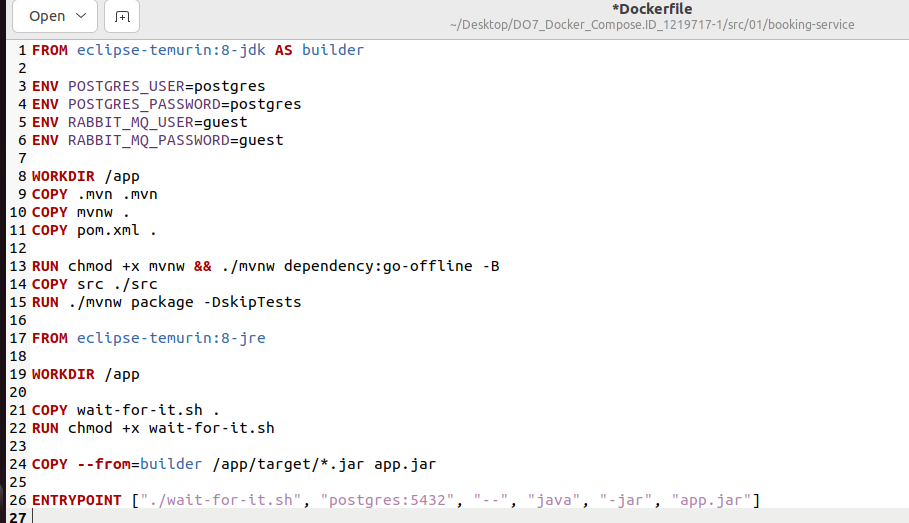

**Размер образов:**

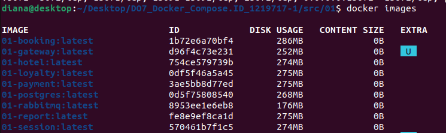

**Размер образа booking-service:**

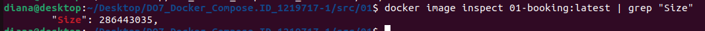


### 2. Напиши Docker Compose файл, который осуществляет корректное взаимодействие сервисов. Пробрось порты для доступа к gateway service и session service из локальной машины. 

**Docker Compose:**

``` services:
  postgres:
    build: "./postgres"
    container_name: postgres
    ports:
      - "5432:5432"
    environment:
      POSTGRES_USER: postgres
      POSTGRES_PASSWORD: postgres
      POSTGRES_DB: app
    volumes:
      - app:/var/lib/postgresql/data


  rabbitmq:
    build: "./rabbitmq"
    container_name: rabbitmq
    ports:
      - "15672:15672"
      - "5672:5672"
    environment:
      RABBIT_MQ_USER: guest
      RABBIT_MQ_PASSWORD: guest

  session-service:
    build: "./session-service"
    container_name: session
    ports:
      - "8081:8081"
    environment:
      POSTGRES_HOST: postgres
      POSTGRES_PORT: 5432
      POSTGRES_DB: app
      POSTGRES_USER: postgres
      POSTGRES_PASSWORD: postgres
      RABBIT_MQ_HOST: rabbitmq
      RABBIT_MQ_PORT: 5672
      RABBIT_MQ_USER: guest
      RABBIT_MQ_PASSWORD: guest
    depends_on:
      - postgres


  hotel-service:
    build: "./hotel-service"
    container_name: hotel
    ports:
      - "8082:8082"
    environment:
      POSTGRES_HOST: postgres
      POSTGRES_PORT: 5432
      POSTGRES_DB: hotels_db
      POSTGRES_USER: postgres
      POSTGRES_PASSWORD: postgres
    depends_on:
      - postgres

  payment-service:
    build: "./payment-service"
    container_name: payment
    ports:
      - "8084:8084"
    environment:
      POSTGRES_HOST: postgres
      POSTGRES_PORT: 5432
      POSTGRES_DB: payments_db
      POSTGRES_USER: postgres
      POSTGRES_PASSWORD: postgres
    depends_on:
      - postgres

  loyalty-service:
    build: "./loyalty-service"
    container_name: loyalty
    ports:
      - "8085:8085"
    environment:
      POSTGRES_HOST: postgres
      POSTGRES_PORT: 5432
      POSTGRES_DB: balances_db
      POSTGRES_USER: postgres
      POSTGRES_PASSWORD: postgres
    depends_on:
      - postgres


  report-service:
    build: "./report-service"
    container_name: report
    ports:
      - "8086:8086"
    environment:
      POSTGRES_HOST: postgres
      POSTGRES_PORT: 5432
      POSTGRES_DB: statistics_db
      POSTGRES_USER: postgres
      POSTGRES_PASSWORD: postgres
      RABBIT_MQ_HOST: rabbitmq
      RABBIT_MQ_PORT: 5672
      RABBIT_MQ_USER: guest
      RABBIT_MQ_PASSWORD: guest
      RABBIT_MQ_QUEUE_NAME: messagequeue
      RABBIT_MQ_EXCHANGE: messagequeue-exchange
    depends_on:
      - postgres


  booking-service:
    build: "./booking-service"
    container_name: booking
    ports:
      - "8083:8083"
    environment:
      POSTGRES_HOST: postgres
      POSTGRES_PORT: 5432
      POSTGRES_DB: reservations_db
      POSTGRES_USER: postgres
      POSTGRES_PASSWORD: postgres
      RABBIT_MQ_HOST: rabbitmq
      RABBIT_MQ_PORT: 5672
      RABBIT_MQ_USER: guest
      RABBIT_MQ_PASSWORD: guest
      RABBIT_MQ_QUEUE_NAME: messagequeue
      RABBIT_MQ_EXCHANGE: messagequeue-exchange
      HOTEL_SERVICE_HOST: hotel
      HOTEL_SERVICE_PORT: 8082
      PAYMENT_SERVICE_HOST: payment
      PAYMENT_SERVICE_PORT: 8084
      LOYALTY_SERVICE_HOST: loyalty
      LOYALTY_SERVICE_PORT: 8085
    depends_on:
      - postgres
      - rabbitmq
      - hotel-service
      - payment-service
      - loyalty-service

  gateway-service:
    build: "./gateway-service"
    container_name: gateway
    ports:
      - "8087:8087"
    environment:
      SESSION_SERVICE_HOST: session
      SESSION_SERVICE_PORT: 8081
      HOTEL_SERVICE_HOST: hotel
      HOTEL_SERVICE_PORT: 8082
      BOOKING_SERVICE_HOST: booking
      BOOKING_SERVICE_PORT: 8083
      PAYMENT_SERVICE_HOST: payment
      PAYMENT_SERVICE_PORT: 8084
      LOYALTY_SERVICE_HOST: loyalty
      LOYALTY_SERVICE_PORT: 8085
      REPORT_SERVICE_HOST: report
      REPORT_SERVICE_PORT: 8086
    depends_on:
      - session-service
      - postgres
      - hotel-service
      - booking-service
      - payment-service
      - loyalty-service
      - report-service


volumes:
  app:

```

### 3. Собери и разверни веб-сервис с помощью написанного Docker Compose файла на локальной машине.

**Смотрим запущенные контейнеры:**

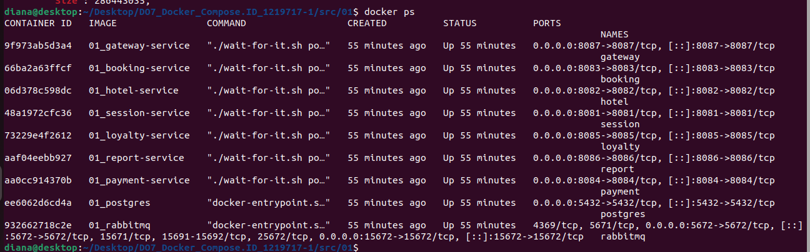

### 4. Прогони заготовленные тесты через postman и удостоверься, что все они проходят успешно. 

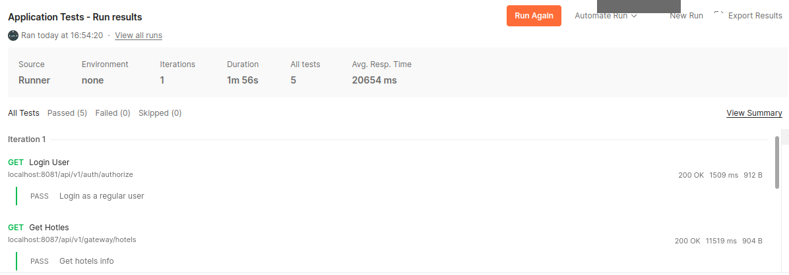
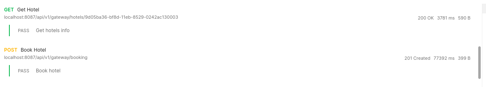
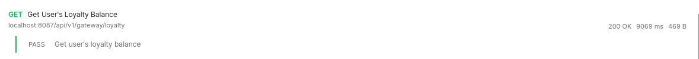


## Part 2. Создание виртуальных машин

### 1. Установи и инициализируй Vagrant в корне проекта. Напиши Vagrantfile для одной виртуальной машины. Перенеси исходный код веб-сервиса в рабочую директорию виртуальной машины. 


Скачиваю и устанавливаю Vagrant
В корневой папке проекта инициализирую его:

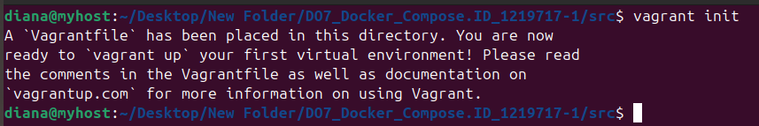


Редактирую Vagrantfile: выбираю образ ``` ubuntu/jammy64 ```, делаю проброс портов, чтобы был доступ к микросервисам с хоста, копирую файлы из папки проекта внутрь VM, вписываю скрипты для загрузки пакетов, выделяю swap и делаю автоматическую сборку микросервисов

```
Vagrant.configure("2") do |config|
  config.vm.box = "ubuntu/jammy64"

  config.vm.network "forwarded_port", guest: 5432, host: 5432    
  config.vm.network "forwarded_port", guest: 5672, host: 5672   
  config.vm.network "forwarded_port", guest: 15672, host: 15672  
  config.vm.network "forwarded_port", guest: 8081, host: 8081    
  config.vm.network "forwarded_port", guest: 8082, host: 8082    
  config.vm.network "forwarded_port", guest: 8083, host: 8083    
  config.vm.network "forwarded_port", guest: 8084, host: 8084    
  config.vm.network "forwarded_port", guest: 8085, host: 8085    
  config.vm.network "forwarded_port", guest: 8086, host: 8086    
  config.vm.network "forwarded_port", guest: 8087, host: 8087    
  
  config.vm.synced_folder ".", "/vagrant"
  
  config.vm.provision "shell", inline: <<-SHELL
    apt-get update
    apt-get install -y curl
    curl -fsSL https://get.docker.com | sh
    apt-get install -y docker-compose-plugin
    usermod -aG docker vagrant
    
    if ! swapon --show | grep -q '/swapfile'; then
      fallocate -l 2G /swapfile
      chmod 600 /swapfile
      mkswap /swapfile
      swapon /swapfile
      echo '/swapfile none swap sw 0 0' >> /etc/fstab
    fi
    
    cd /vagrant
    docker compose up --build
  SHELL
  
end

```

Поднимаю ВМ


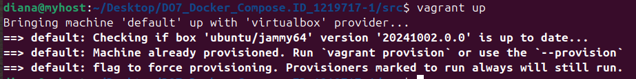

### 2. Зайди через консоль внутрь виртуальной машины и удостоверься, что исходный код встал, куда нужно. Останови и уничтожь виртуальную машину.

Захожу в нее при помощи команды ``` vagrant ssh ``` и происходит автоматическое выполнение вышеописанных скриптов

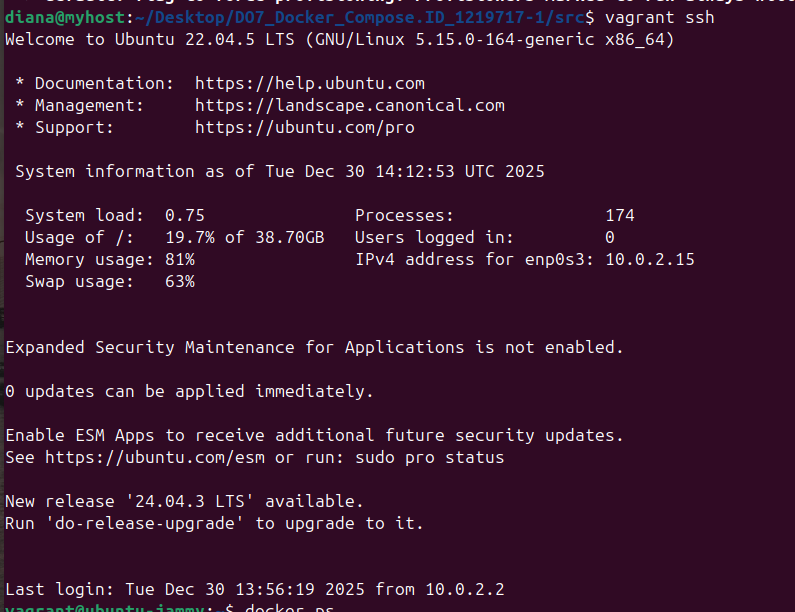


При помощи ``` docker ps ``` проверяю, что все контейнеры с микросервисами подняты

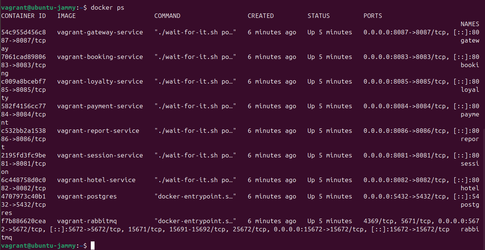


В Postman прогоняю тесты и вижу, что все проходит успешно

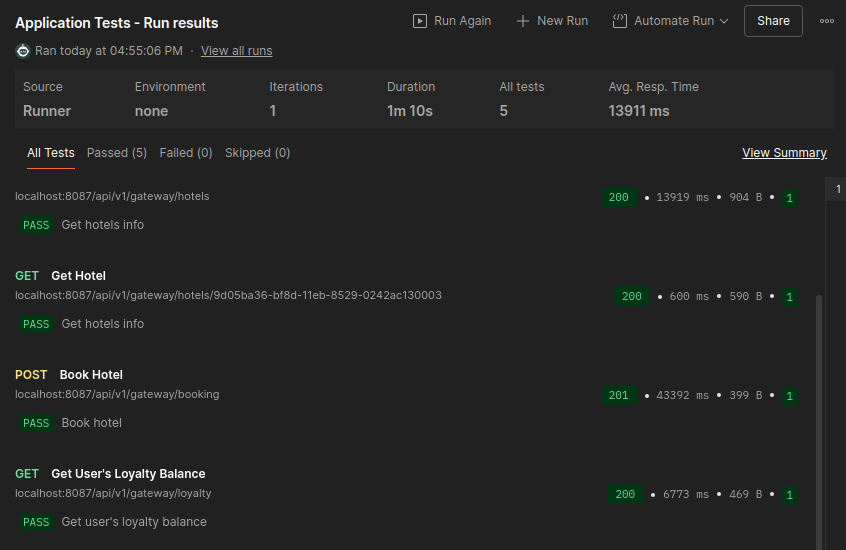


Выхожу из машины ``` exit ```

Останавливаю ``` vagrant halt ```

Проверяю статус ``` vagrant status ```

Удаляю ``` vagrant destroy ``` и снова проверяю статус

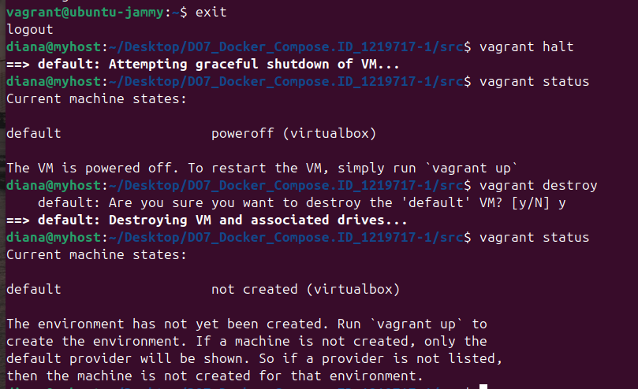


## Part 3. Создание простейшего Docker Swarm

### 1. Модифицируй Vagrantfile для создания трех машин: manager01, worker01, worker02. Напиши shell-скрипты для установки Docker внутрь машин, инициализации и подключения к Docker Swarm.

Создаю папку TASK_3 для удобства, копирую нужные файлы, ввожу ``` vagrant init ```

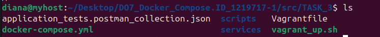


**Vagrantfile.** В нем монтирую файлы из корневой папки в папку ``` vagrant```. Создаю 3 машины - manager01, worker01, worker02. Добавляю частную сеть и выдаю айпи каждой машине. Когда машины созданы, запускается скрипт ```base_script.sh```, в котором описаны дальнейшие действия.


```

Vagrant.configure("2") do |config|
  config.vm.box = "ubuntu/jammy64"
  config.vm.synced_folder ".", "/vagrant"
  
  config.vm.provision "shell", inline: <<-SHELL
    while [ ! -d /vagrant/scripts ]; do
      sleep 1
    done
    
    chmod +x /vagrant/scripts/*
    /vagrant/scripts/base_script.sh
  SHELL
  
  config.vm.define "manager01" do |manager|
    manager.vm.hostname = "manager01"
    manager.vm.network "private_network", ip: "192.168.56.10"
    end
  
  config.vm.define "worker01" do |worker|
    worker.vm.hostname = "worker01"
    worker.vm.network "private_network", ip: "192.168.56.11"
    end
    
  config.vm.define "worker02" do |worker|
    worker.vm.hostname = "worker02"
    worker.vm.network "private_network", ip: "192.168.56.12"
    end

end

```


**base_script.sh:** через него устанавливаю необходимые пакеты на машинах, выделяю swap, открываю необходимые порты для Docker Swarm (``` manager_ports.sh```, ``` worker_ports.sh```), инициализирую Swarm на менеджере ( ``` manager_swarm.sh```) и подключаюсь к Swarm на воркерах (``` token.sh ```)

```

#!/bin/bash

apt-get update
    apt-get install -y curl firewalld
    curl -fsSL https://get.docker.com | sh
    apt-get install -y docker-compose-plugin
    usermod -aG docker vagrant
    
    systemctl enable firewalld
    systemctl start firewalld
    
    if ! swapon --show | grep -q '/swapfile'; then
      fallocate -l 1G /swapfile
      chmod 600 /swapfile
      mkswap /swapfile
      swapon /swapfile
      echo '/swapfile none swap sw 0 0' >> /etc/fstab
    fi
    
    case "$HOSTNAME" in
      manager01)
        /vagrant/scripts/manager_ports.sh
        /vagrant/scripts/manager_swarm.sh
        ;;
      worker*)
        /vagrant/scripts/worker_ports.sh
        /vagrant/scripts/token.sh
        ;;
    esac
    
```


**manager_ports.sh**

```
#!/bin/bash

firewall-cmd --add-port=2376/tcp --permanent
firewall-cmd --add-port=2377/tcp --permanent
firewall-cmd --add-port=7946/tcp --permanent
firewall-cmd --add-port=7946/udp --permanent
firewall-cmd --add-port=4789/udp --permanent
firewall-cmd --reload

systemctl restart docker
```


**worker_ports.sh**

```
#!/bin/bash

firewall-cmd --add-port=2376/tcp --permanent
firewall-cmd --add-port=7946/tcp --permanent
firewall-cmd --add-port=7946/udp --permanent
firewall-cmd --add-port=4789/udp --permanent
firewall-cmd --reload

systemctl restart docker
```


**manager_swarm.sh** создает скрипт ```token.sh``` для поключения воркеров к swarm

```
#!/bin/bash

TOKEN=$(docker swarm init --advertise-addr 192.168.56.10 | awk 'NR==5')

echo "#!/bin/bash" >> /vagrant/scripts/token.sh
echo "$TOKEN" >> /vagrant/scripts/token.sh

chmod + x /vagrant/scripts/token.sh

```

**token.sh**

```
#!/bin/bash
    docker swarm join --token SWMTKN-1-3tz825xk924hb8c5yvusimdekkbsmsicw52ekjod5qpkldhybl-65c8rhyh264otd6noylxil0kt 192.168.56.10:2377

```


Создаю машины скриптом ```vagrant_up.sh``` (в нем машины поднимаются последовательно, а не параллельно)

**vagrant_up.sh**

```
#!/bin/bash

vagrant up manager01
vagrant up worker01
vagrant up worker02
```


Проверяю статус машин

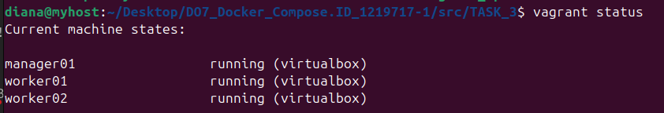

Захожу в машину manager01 и проверяю, что все ноды подключены

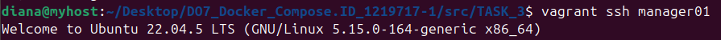

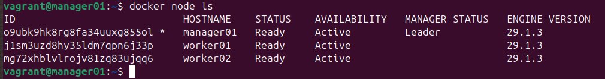


### Загрузи собранные образы на Docker Hub и модифицируй Docker Compose файл для подгрузки расположенных на Docker Hub образов.

Проверяю наличие всех образов

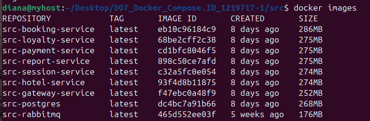

Захожу под своей учеткой

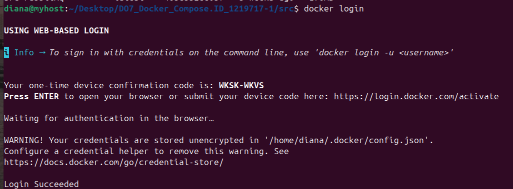

Добавляю теги

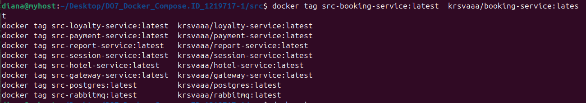

Пушу образы

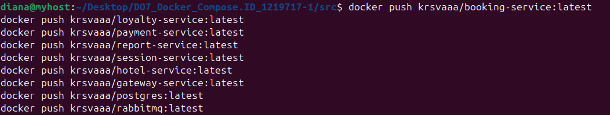

В Docker Hub проверяю, что все выгрузилось

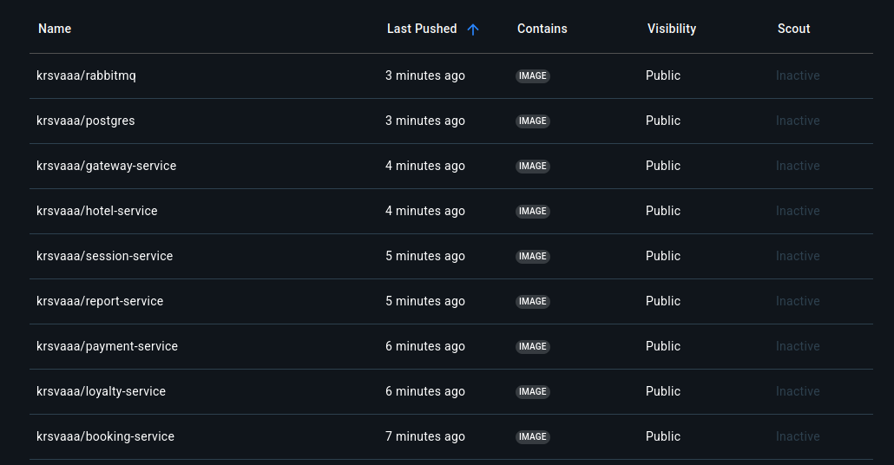

Изменяю **docker-compose.yml**, чтобы сервисы поднимались на основе готовых образов

``` 
services:
  postgres:
    image: krsvaaa/postgres:latest
    ports:
      - "5432:5432"
    environment:
      TZ: "Europe/Moscow"
      POSTGRES_USER: postgres
      POSTGRES_PASSWORD: postgres
      POSTGRES_DB: app
    volumes:
      - app:/var/lib/postgresql/data
    deploy:
      placement:
        constraints:
          - node.role == manager

  rabbitmq:
    image: krsvaaa/rabbitmq:latest
    ports:
      - "15672:15672"
      - "5672:5672"
    environment:
      TZ: "Europe/Moscow"

  session-service:
    image: krsvaaa/session-service:latest
    ports:
      - "8081:8081"
    environment:
      POSTGRES_HOST: postgres
      POSTGRES_PORT: 5432
      POSTGRES_DB: app
      POSTGRES_USER: postgres
      POSTGRES_PASSWORD: postgres
      RABBIT_MQ_HOST: rabbitmq
      RABBIT_MQ_PORT: 5672
      RABBIT_MQ_USER: guest
      RABBIT_MQ_PASSWORD: guest
      TZ: "Europe/Moscow"

  hotel-service:
    image: krsvaaa/hotel-service:latest
    ports:
      - "8082:8082"
    environment:
      POSTGRES_HOST: postgres
      POSTGRES_PORT: 5432
      POSTGRES_DB: hotels_db
      POSTGRES_USER: postgres
      POSTGRES_PASSWORD: postgres
      TZ: "Europe/Moscow"

  payment-service:
    image: krsvaaa/payment-service:latest
    ports:
      - "8084:8084"
    environment:
      POSTGRES_HOST: postgres
      POSTGRES_PORT: 5432
      POSTGRES_DB: payments_db
      POSTGRES_USER: postgres
      POSTGRES_PASSWORD: postgres
      TZ: "Europe/Moscow"

  loyalty-service:
    image: krsvaaa/loyalty-service:latest
    ports:
      - "8085:8085"
    environment:
      POSTGRES_HOST: postgres
      POSTGRES_PORT: 5432
      POSTGRES_DB: balances_db
      POSTGRES_USER: postgres
      POSTGRES_PASSWORD: postgres
      TZ: "Europe/Moscow"

  report-service:
    image: krsvaaa/report-service:latest
    ports:
      - "8086:8086"
    environment:
      POSTGRES_HOST: postgres
      POSTGRES_PORT: 5432
      POSTGRES_DB: statistics_db
      POSTGRES_USER: postgres
      POSTGRES_PASSWORD: postgres
      RABBIT_MQ_HOST: rabbitmq
      RABBIT_MQ_PORT: 5672
      RABBIT_MQ_USER: guest
      RABBIT_MQ_PASSWORD: guest
      RABBIT_MQ_QUEUE_NAME: messagequeue
      RABBIT_MQ_EXCHANGE: messagequeue-exchange
      TZ: "Europe/Moscow"

  booking-service:
    image: krsvaaa/booking-service:latest
    ports:
      - "8083:8083"
    environment:
      POSTGRES_HOST: postgres
      POSTGRES_PORT: 5432
      POSTGRES_DB: reservations_db
      POSTGRES_USER: postgres
      POSTGRES_PASSWORD: postgres
      RABBIT_MQ_HOST: rabbitmq
      RABBIT_MQ_PORT: 5672
      RABBIT_MQ_USER: guest
      RABBIT_MQ_PASSWORD: guest
      RABBIT_MQ_QUEUE_NAME: messagequeue
      RABBIT_MQ_EXCHANGE: messagequeue-exchange
      HOTEL_SERVICE_HOST: hotel-service
      HOTEL_SERVICE_PORT: 8082
      PAYMENT_SERVICE_HOST: payment-service
      PAYMENT_SERVICE_PORT: 8084
      LOYALTY_SERVICE_HOST: loyalty-service
      LOYALTY_SERVICE_PORT: 8085
      TZ: "Europe/Moscow"

  gateway-service:
    image: krsvaaa/gateway-service:latest
    ports:
      - "8087:8087"
    environment:
      SESSION_SERVICE_HOST: session-service
      SESSION_SERVICE_PORT: 8081
      HOTEL_SERVICE_HOST: hotel-service
      HOTEL_SERVICE_PORT: 8082
      BOOKING_SERVICE_HOST: booking-service
      BOOKING_SERVICE_PORT: 8083
      PAYMENT_SERVICE_HOST: payment-service
      PAYMENT_SERVICE_PORT: 8084
      LOYALTY_SERVICE_HOST: loyalty-service
      LOYALTY_SERVICE_PORT: 8085
      REPORT_SERVICE_HOST: report-service
      REPORT_SERVICE_PORT: 8086
      TZ: "Europe/Moscow"

volumes:
  app:
  
```


### 3. Подними виртуальные машины и перенеси на менеджер Docker Compose файл. Запусти стек сервисов, используя написанный Docker Compose файл

Захожу в manager, скачиваю образы из Hub

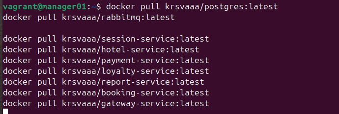


Проверяю

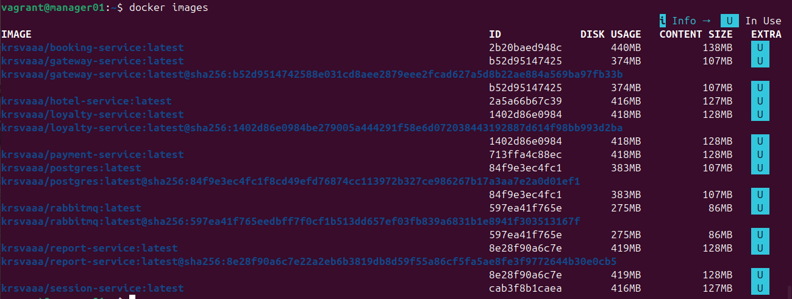


Деплою


Проверяю

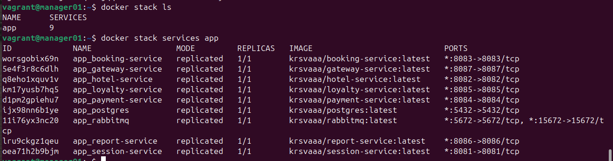

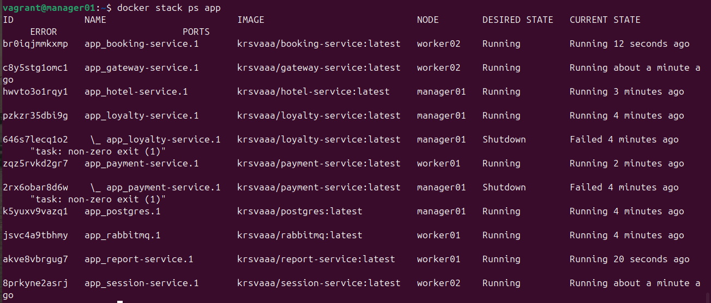


### 4. Настрой прокси на базе nginx для доступа к gateway service и session service по оверлейной сети. Сами gateway service и session service сделай недоступными напрямую.

Создаю **nginx.conf**

```
server {
    listen 80;
    
    location / {
        proxy_pass http://session-service:8081;
    }
}

server {
    listen 81;
    
    location / {
        proxy_pass http://gateway-service:8087;
    }
}

```

Добавляю следующие изменения в **docker-compose.yml**

Прописываю новую оверлейную сеть, добавляю конфиг nginx и новый сервис nginx, удаляю порты в session и gateway

```
networks:
  app_default:
    external: false

configs:
  nginx_conf:
    external: true

services:
  nginx:
    image: nginx:latest
    ports:
      - "8081:80"
      - "8087:81"
    networks:
      - app_default
    configs:
      - source: nginx_conf
        target: /etc/nginx/conf.d/default.conf
    deploy:
      placement:
        constraints:
          - node.role == manager

```

**session и gateway**

```
session-service:
    image: krsvaaa/session-service:latest
    environment:
      POSTGRES_HOST: postgres
      POSTGRES_PORT: 5432
      POSTGRES_DB: app
      POSTGRES_USER: postgres
      POSTGRES_PASSWORD: postgres
      RABBIT_MQ_HOST: rabbitmq
      RABBIT_MQ_PORT: 5672
      RABBIT_MQ_USER: guest
      RABBIT_MQ_PASSWORD: guest
      TZ: "Europe/Moscow"
    networks:
      - app_default
    deploy:
      placement:
        constraints:
          - node.role == manager
          
gateway-service:
    image: krsvaaa/gateway-service:latest
    environment:
      SESSION_SERVICE_HOST: session-service
      SESSION_SERVICE_PORT: 8081
      HOTEL_SERVICE_HOST: hotel-service
      HOTEL_SERVICE_PORT: 8082
      BOOKING_SERVICE_HOST: booking-service
      BOOKING_SERVICE_PORT: 8083
      PAYMENT_SERVICE_HOST: payment-service
      PAYMENT_SERVICE_PORT: 8084
      LOYALTY_SERVICE_HOST: loyalty-service
      LOYALTY_SERVICE_PORT: 8085
      REPORT_SERVICE_HOST: report-service
      REPORT_SERVICE_PORT: 8086
      TZ: "Europe/Moscow"
    networks:
      - app_default
    deploy:
      placement:
        constraints:
          - node.role == manager
          
```

В **Vagrantfile** пробрасываю порты к session и gateway только на менеджере

```
config.vm.define "manager01" do |manager|
    manager.vm.hostname = "manager01"
    manager.vm.network "private_network", ip: "192.168.56.10"
    manager.vm.network "forwarded_port", guest: 8081, host: 8081
    manager.vm.network "forwarded_port", guest: 8087, host: 8087
    end
    
```

Добавляю скрипт **manager_deploy.sh**, который автоматически будет добавлять конфиг nginx и деплоить стек. Запускается из base_script.sh

```
#!/bin/bash

docker config create nginx_conf /vagrant/nginx_conf
docker stack deploy --with-registry-auth -c /vagrant/docker-compose.yml app
```


Снова поднимаю машины и прогоняю тесты Postman

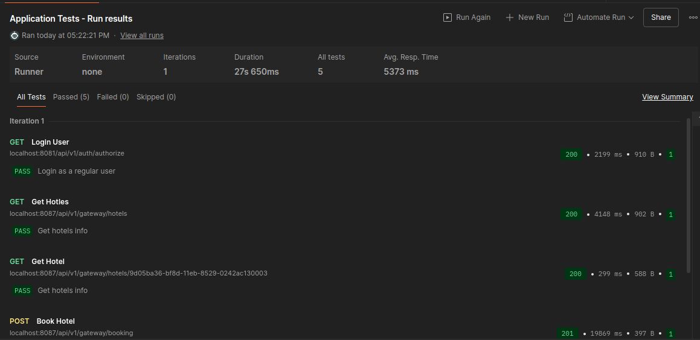


Распределение контейнеров по узлам:

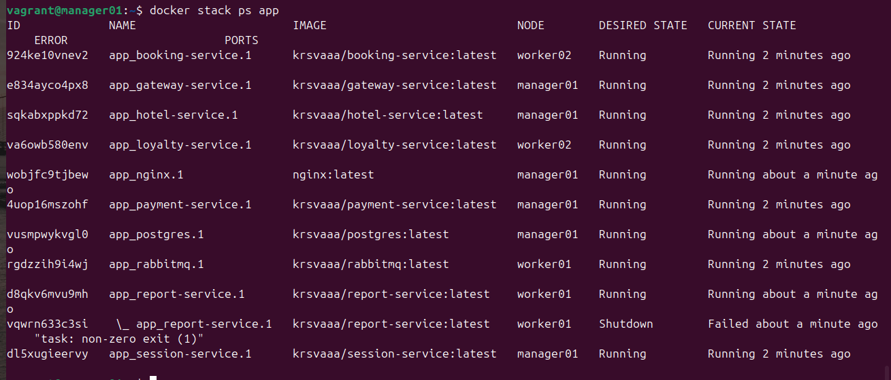


### 7. Установи отдельным стеком Portainer внутри кластера. В отчете отобрази визуализацию распределения задач по узлам с помощью Portainer.

Создаю файл **portainer-stack.yml**


```

services:
  portainer:
    image: portainer/portainer-ce:latest
    command: -H unix:///var/run/docker.sock
    ports:
      - "9000:9000"
    volumes:
      - /var/run/docker.sock:/var/run/docker.sock
      - portainer_data:/data
    deploy:
      placement:
        constraints:
          - node.role == manager
      replicas: 1

volumes:
  portainer_data:
  
```

В Vagrantfile включаю gui на менеджере и захожу в машину

Деплою Portainer

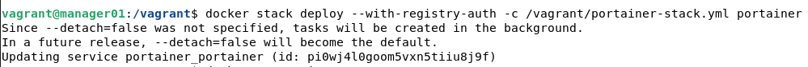

Проверяю, что все сервисы подняты

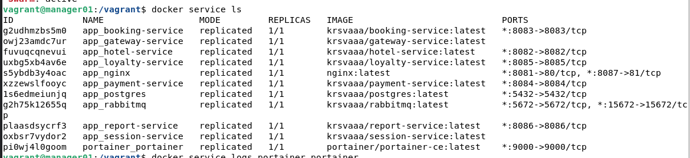


В браузере захожу на ```http://localhost:9000```, регистрируюсь и проверяю распределение сервисов по узлам


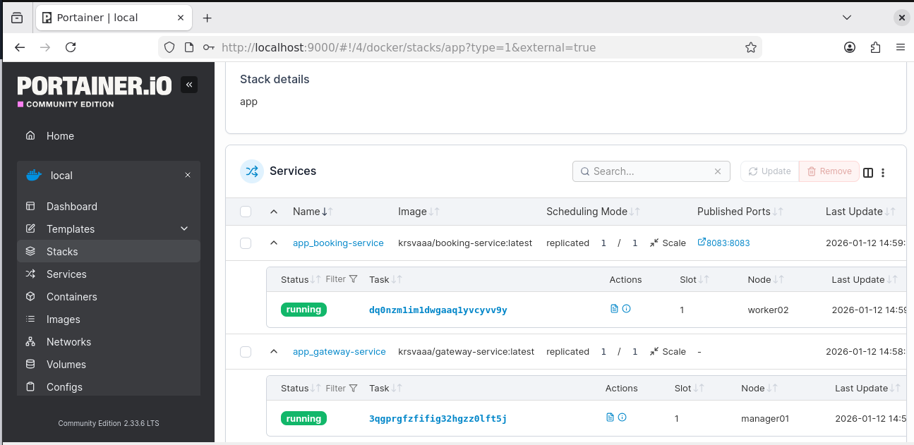

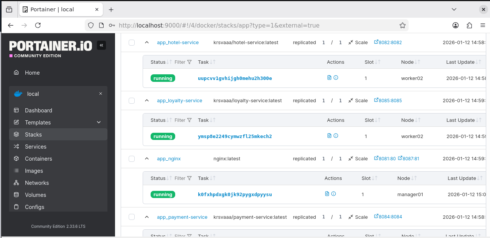

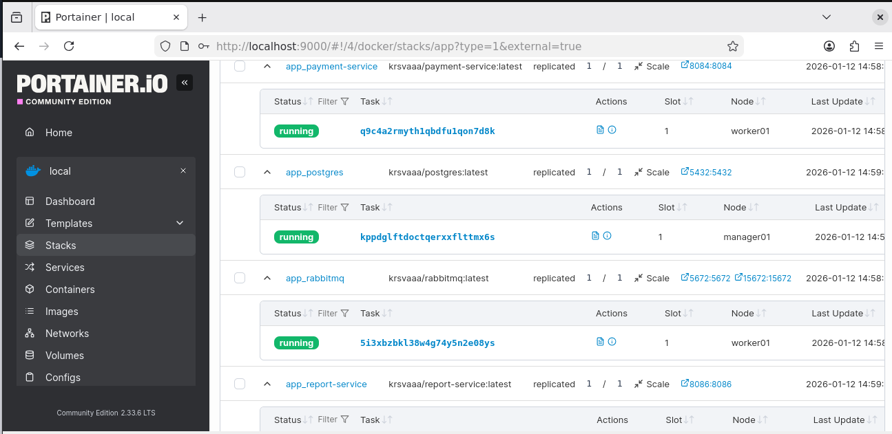

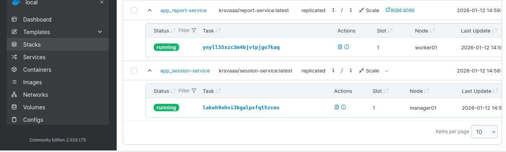
